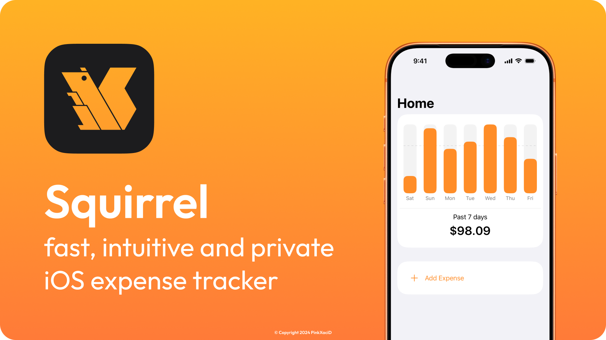
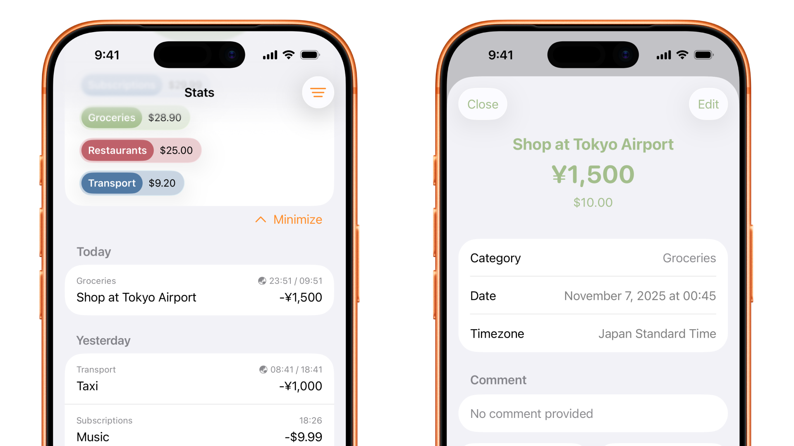
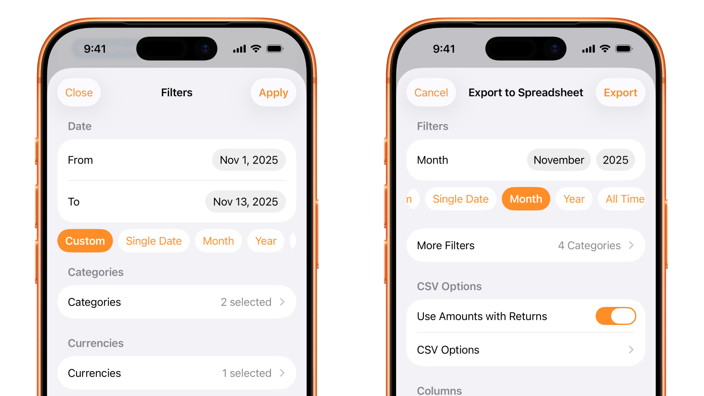

# Squirrel

Available for iOS 15 and later.

## Why Squirrel?
- Simple and intuitive interface
- No account needed
- All data stored locally, on your device

## Main functions:
- ### Simple and clear charts

- ### Track expenses in different currencies with exchange rates updated every hour.

- ### Advanced filters and data export

*This code is available under a GPL v3 license. [Learn more.](LICENSE)*
