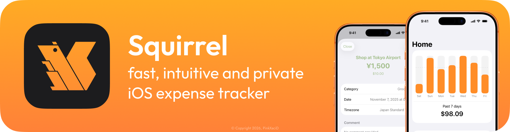
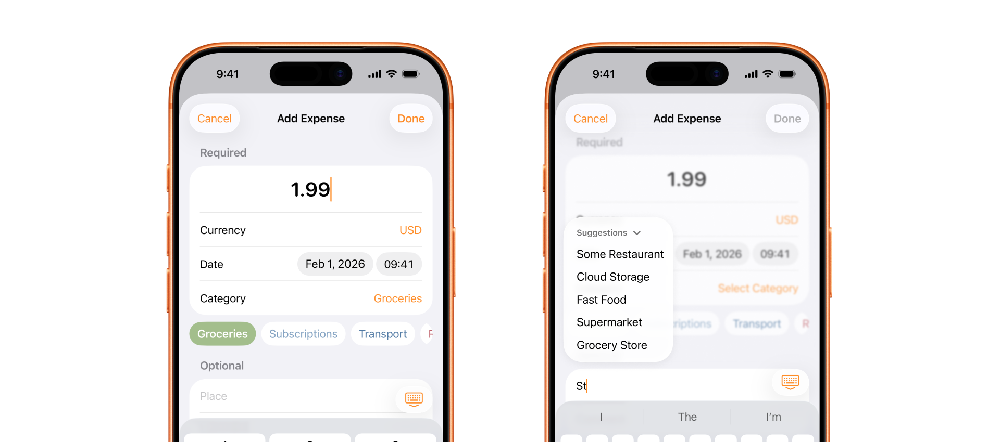
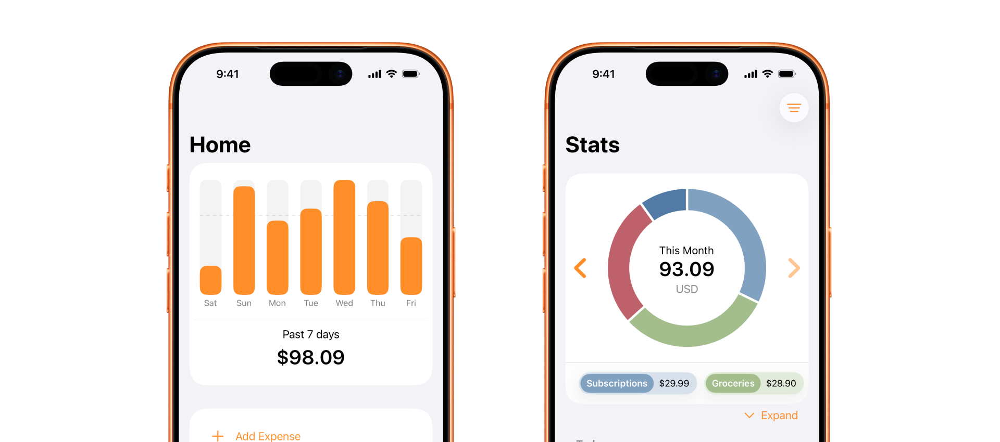
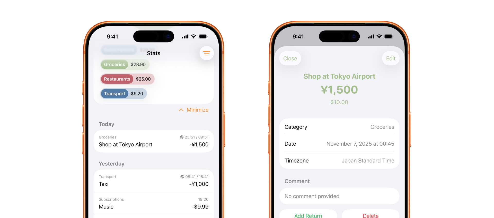
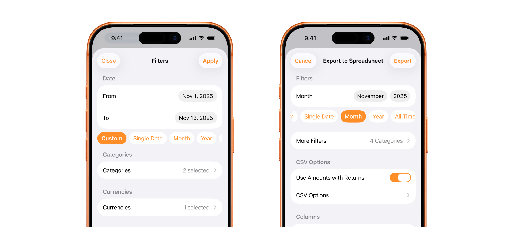

# Squirrel

Squirrel is a simple, fast and powerful expense tracker for iOS built with privacy in mind.

Available for iOS 15.0 and later.

## Highlights:

- Simple and intuitive interface. Fast expense input with quick category and place suggestions.
- No account or tracking.
- All data is stored locally on your device with optional iCloud integration.
- Free forever. Squirrel is designed to have very little ongoing cost to make it free for everyone.
- Zero AI features and 100% organic human code.

## Features:

### Fast and Detailed Expense Tracking

Add your expenses quickly - Squirrel suggests most used categories and autocompletes places right as you type. Track returns when a friend pays you back or an order is canceled. Back up your data to iCloud, but only if you want to.

### Simple and Clear Charts

Evaluate your expenses at a glance. Quickly see your weekly total or daily average right on the home screen. Or switch to the stats view for more detailed analytics.

### Track Your Expenses Across Currencies and Timezones

Track expenses in 150+ currencies that are updated every hour. Squirrel automatically converts currencies and records timezones so you won't be guessing when or how much. You can also separate the display and default input currency when travelling.

### Advanced Filters and Data Export

Filter expenses by date, category, currency and more with powerful and simple filters. Export filtered data to CSV with many formatting options and back up your expenses locally to a JSON file.

## Testing

Squirrel does not have automated tests for now, but it is actively tested on devices running the latest iOS 15, 18, and 26. Feel free to open [an issue](https://github.com/PinkXaciD/Squirrel/issues/new) if anything goes wrong.

## License and Copyright

*This code is lisenced under GPLv3. [Learn more.](LICENSE)*

*The Squirrel logo, app icon or any promotional materials cannot be used for any commercial purpose without explicit permission. © Copyright 2026, PinkXaciD.*