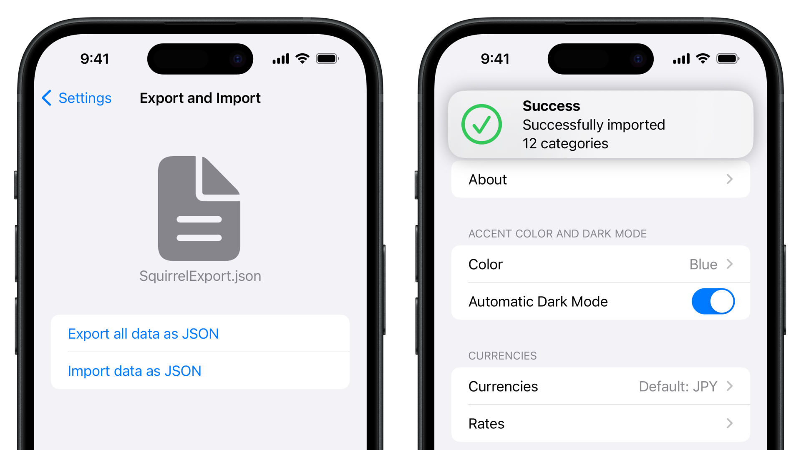

# Squirrel

**Simple iOS native app for spendings control, written using SwiftUi (in progress)**

## Why Squirrel is not another spending tracker app?
- Simple and intuitive interface
- No account needed
- All data stored locally, on your device

## Main functions:
- Simple and clear charts

- Track expenses in different currencies with exchange rates updated every hour.

- Light and dark mode with different accent colors

- Data export and import in JSON format

## How to install?
Currently not available on the App Store, but you can build this app yourself!
