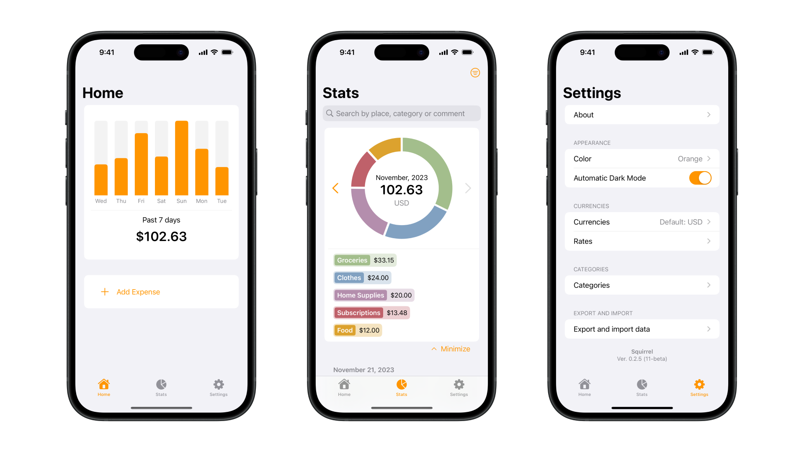
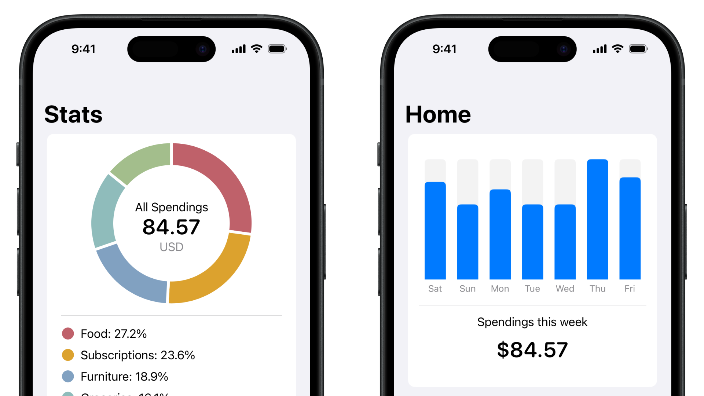
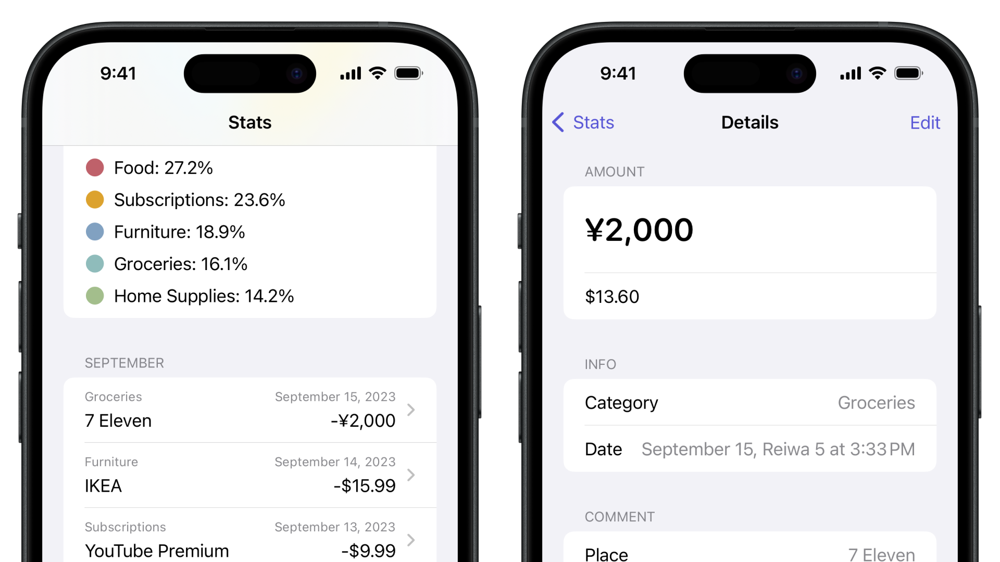
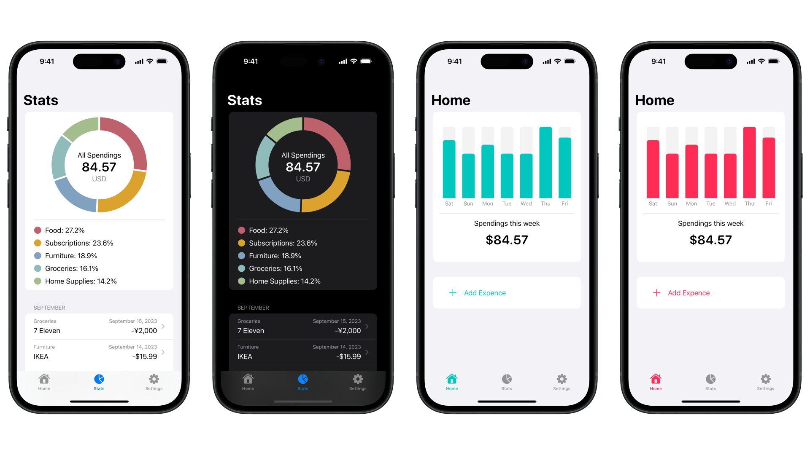

# Squirrel

**Simple iOS native app for spendings control, written using SwiftUi**

## Why Squirrel is not another spending tracker app?
- Simple and intuitive interface
- No account needed
- All data stored locally, on your device

## Main functions:
- Simple and clear charts

- Track expenses in different currencies with exchange rates updated once an hour.

- Light and dark mode with different accent colors

- Data export (in progress)

## How to install?
Follow link on top to AppStore/TestFlight or build it yourself!
